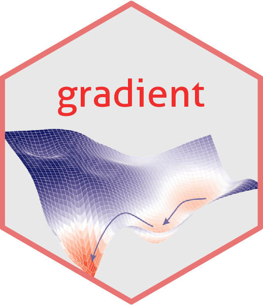

<!-- README.md is generated from README.Rmd. Please edit that file -->

# gradient 

<!-- badges: start -->
[](https://travis-ci.com/vincnardelli/gradient)
[](https://codecov.io/gh/vincnardelli/gradient?branch=master)
<!-- badges: end -->

## Overview

**gradient** is a small package for efficient descent computation. Using _gradient_ it is possible to perform steepest descent or gradient descent to fit linear models. Moreover the package contains a series of function for inspecting the convergence of the algorithm. Find out more in the vingnette.

## Installation

``` r
# The easiest way to get gradient is to install it from GitHub:
# install.packages("devtools")
devtools::install_github("vincnardelli/gradient")
```


### Authors and mantainers
Alice Giampino - a.giampino@campus.unimib.it

Vincenzo Nardelli - v.nardelli2@campus.unimib.it
